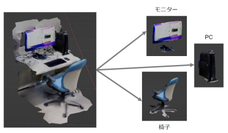

# Automatic-3D-model-extraction-system-using-LiDAR-and-object-surface-attributes

iPhoneのLiDARで取得した3Dデータを対象に，BlenderとYOLOを用いて物体ごとに3Dデータを自動的に抽出するシステムです．

## 概要

このシステムはiPadに搭載されているLiDARとカメラを用いて現実の空間やオブジェクト(物体)を3Dスキャンし，その3DスキャンデータをBlenderとYOLOを用いて物体ごとに3Dデータを自動的に抽出するシステムです．基本的に3Dスキャンした3Dデータはすべてのオブジェクトが一体化していますが，抽出するオブジェクトを選択するとそのオブジェクト以外のポリゴンを削除していき，選択したオブジェクトだけが残ります．

またスキャン時に現実世界の(Ceiling，Door，Floor，Seat，Table，Wall，Window，Noneの8種類の)オブジェクトを分類することができ，iPad上でそのオブジェクトのポリゴンをタップすると分類結果テキストが仮想オブジェクトとして表示されます．objファイルは全ての点群を含んだものと(最大8種類の)分類ごとの点群を含んだものが出力される(出力例は「3DScan-Classify-ExportOBJ/ObjFile」にあります)．

このシステムはAppleが提供している「[VisualizingAndInteractingWithAReconstructedScene](https://developer.apple.com/jp/documentation/arkit/world_tracking/visualizing_and_interacting_with_a_reconstructed_scene/)」をベースにして開発を行いました．主なコードは「3DScan-Classify-ExportOBJ/VisualizingSceneSemantics
/ViewController.swift」です．私が開発した部分は主にタップしたポリゴンの3頂点に仮想の赤い球体を配置する機能とobjファイルの出力を行う機能です．仮想球体を配置機能は分類するポリゴンをより可視化しやすくするために作成しました．objファイル出力機能はスキャンしたものを確認したり他端末で処理するために作成しました．

## 期間
1ヶ月

## 言語と使用フレームワーク
言語：Swift
フレームワーク：ARKit，RealityKit

## 開発環境
個人開発でiPad Proで開発を行いました．

## 制作背景
大学院の研究の一環として作成しました．3Dデータを用いた研究を行っており，3D物体検出・セグメンテーション・物体認識．分類やドローン・車の自動運転などをやっています．iPad ProはカメラやLiDARが搭載されており，またARKitなどのARフレームワークあることから手軽に3Dデータの取得・処理が行えると考えこのシステムを開発しました．MacやSwiftはほとんど触れたことがないため自由にアプリを作るまでに少し時間がかかってしまいましたが，今ではアプリ上の基本的なボタンの作成やARKitの扱い方などを理解し，ARアプリを作成できるようになりました．

## 動作風景URL
動作している様子を撮影しました．アプリを開始してしばらくするとスキャン結果のメッシュが生成され，タップすると仮想球体や分類結果の仮想テキストが表示されます．この動画では実行していませんが，「ObjFile Export」ボタンを押すとobjファイルが出力されます．
URL:[https://youtube.com/shorts/ZHBsXgpZ7_w](https://youtube.com/shorts/ZHBsXgpZ7_w)
